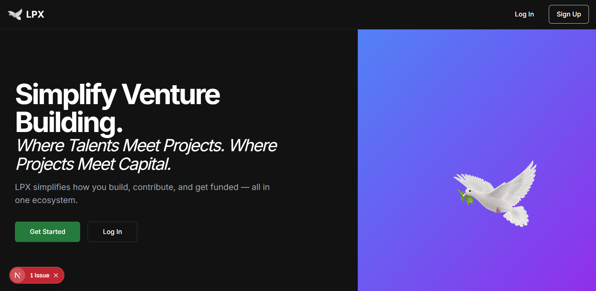

# Launchpad X (LPX)

**Empowering MENA's Builders Through Decentralized Venture Infrastructure**

Launchpad X (LPX) is a smart contract-based platform that helps social impact founders across the MENA region launch tokenized ventures with built-in governance, funding, and trust. Our goal is to bridge the $300B regional funding gap by creating legal, transparent, and community-governed alternatives to traditional venture building.

> "No proof, no opportunity" — LPX fixes that by giving MENA builders access to the infrastructure they need.

---

## 🌍 What It Solves

- 🚫 **Lack of legal & financial infrastructure** for early-stage founders
- 🔁 **Cycle of failure**: No funding → No team → No venture → No impact
- ❌ **Broken trust** between funders and entrepreneurs

---

## 🔧 How LPX Works

A 3-step process for building real-world, tokenized impact ventures:

1. **Onboard**: Founders and contributors join the LPX platform.
2. **Co-build**: Tokenized skill contributions are logged and tracked transparently.
3. **Tokenize**: Projects launch with DAO governance and milestone-based distribution.

The system uses smart contracts on Polygon to manage:
- DAO voting
- Skill-based staking
- Reputation layers (SBTs)
- Milestone validation

---

## 🚀 MVP Features (Current Version)

- ✅ Project creation UI
- ✅ Co-founder blockchain agreement (smart contract signing)
- ✅ Grant viewing interface
- 🛠️ In progress: wallet connect, milestone tracking, DAO voting

[🔗 Live Demo](https://v0-consultant-website-redesign.vercel.app/)  
(Ask in the WhatsApp group for demo account access)

---

## 🛠️ Tech Stack

- **Next.js** (React + SSR)
- **TypeScript**
- **Supabase** (backend, auth)
- **Polygon** smart contracts
- **Tailwind CSS**

---

## 🧪 Getting Started (Local Setup)

### 1. Clone the repo
```bash
git clone https://github.com/your-org/lpx-repo.git
cd lpx-repo
```

### 2. Install dependencies
```bash
npm install
```

### 3. Add environment variables
Copy `.env.example` to `.env.local` and fill in the values:
```bash
cp .env.example .env.local
```

You’ll need:
- `NEXT_PUBLIC_SUPABASE_URL`
- `NEXT_PUBLIC_SUPABASE_ANON_KEY`
- `SUPABASE_SERVICE_ROLE_KEY`
- `SUPABASE_JWT_SECRET`
- `POSTGRES_URL`
- `POSTGRES_PRISMA_URL`
- `POSTGRES_URL_NON_POOLING`
- `POSTGRES_HOST`
- `POSTGRES_USER`
- `POSTGRES_PASSWORD`
- `POSTGRES_DATABASE`

> Get the test keys from the team (request in the WhatsApp group! [Link here](https://chat.whatsapp.com/LcSdoG9l2YCBcngLghqaVj?mode=ac_t).).

### 4. Run the dev server
```bash
npm run dev
```

Go to `http://localhost:3000` and you’re in! Should look like this:


---

## 🤝 Contributing

We’re actively looking for contributors! We also strongly recommend to play around with the website and see what's missing or broken. We will also be adding tasks to the GitHub Issues page. 

### 🛠️ How to contribute

1. Comment on an issue to claim it, or just send a message over in the WhatsApp Group saying what you are going to work on!
2. Fork the repo
3. Create a feature branch:
   ```bash
   git checkout -b feature/my-feature
   ```
4. Push your branch and open a PR (Please add screenshots to all PRs!)

### 📣 WhatsApp Group

Have questions? Join our contributor chat:  
**[Join the WhatsApp group](https://chat.whatsapp.com/LcSdoG9l2YCBcngLghqaVj?mode=ac_t)**

---

## 📌 Roadmap

- [ ] Connect real wallet (Metamask, WalletConnect)
- [ ] Smart contract milestone validator
- [ ] Token-weighted DAO governance
- [ ] Improved onboarding + scoring UX
- [ ] Public grants browsing
- [ ] Dashboard for tracked contributions

---

## 🪪 License

MIT © 2025 W3B Builders Community  
See `LICENSE` file.

---

## 📚 Further Reading

- [Our MENA Builder Vision (Prezi)](https://brief-vole-470.notion.site/LPX-x-HUB71-Prezi-23fd7ae9018b8039b807d2892ebd7060)
- [Launchpad X Memo](https://brief-vole-470.notion.site/Launchpad-X-Memo-1f0d7ae9018b80289333d3c924d0c2e8)

## 📮 Open to partnerships & collaboration
Open to partnerships with NGOs, studios, funds & experts. Contact us to learn more TG @ suzo3 or suheil.zoabi@sfljerusalem.org
